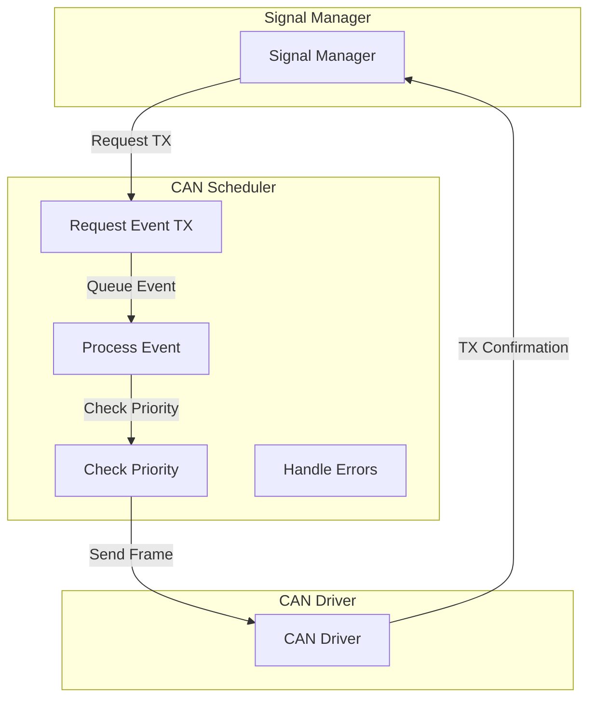
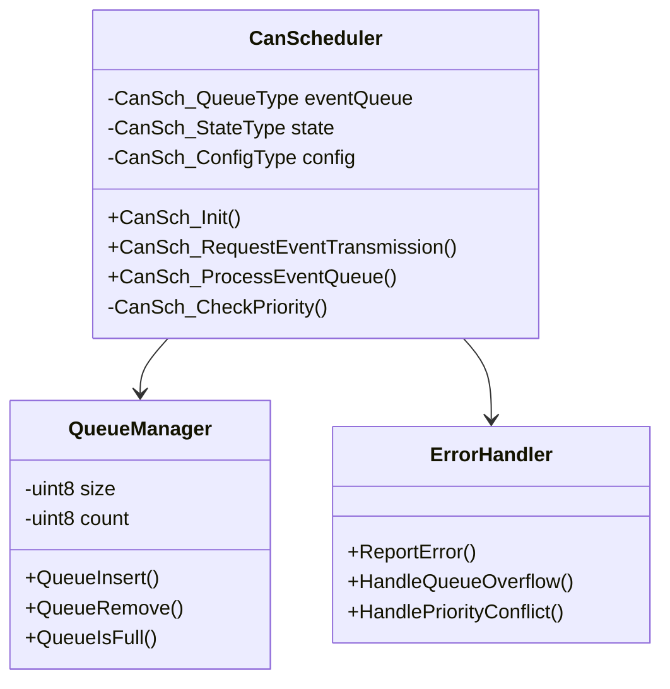
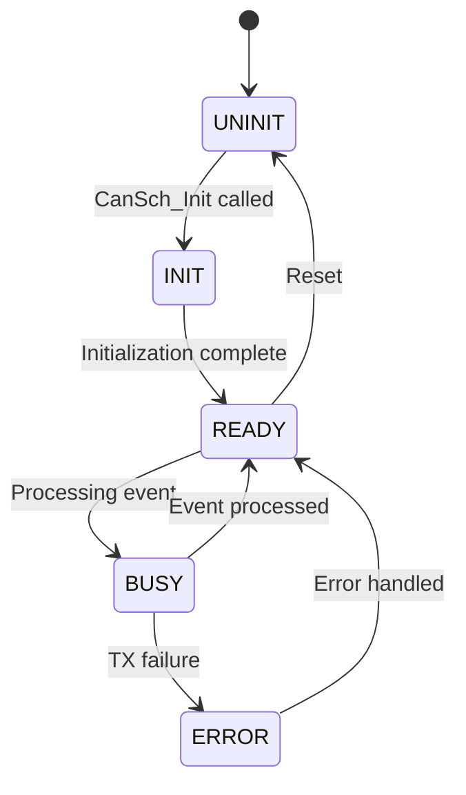
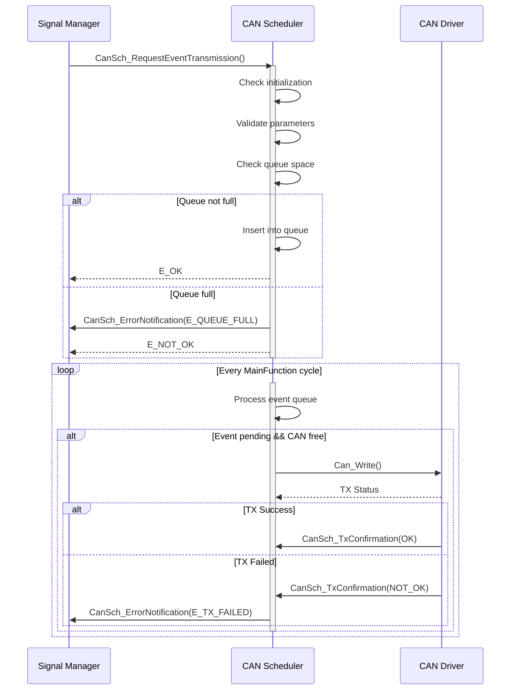

# CAN Scheduler Software Detailed Design
## 1. Introduction

### 1.1 Scope
This document describes the detailed design of the CAN_Scheduler module, specifically focusing on the event frame handling functionality. The module implements ISO 11898 and is responsible for managing and prioritizing CAN event frame transmission requests from upper layers to the CAN Driver.

### 1.2 Definitions and Abbreviations
- API: Application Programming Interface
- CAN: Controller Area Network
- ECU: Electronic Control Unit
- FIFO: First In, First Out
- ISO: International Organization for Standardization
- PDU: Protocol Data Unit
- SW: Software

### 1.3 Constraints
- Compliance with MISRA C:2012 required
- Event queue size limited to configurable maximum entries (default: 32)
- Initialization must complete within 10ms
- CPU utilization: Maximum 5% during queue operations
- Memory footprint: Maximum 8KB for code, 1KB for data
- Priority levels: 0 (highest) to 255 (lowest)

## 2. Module Architecture

### 2.1 Use Case Diagram


### 2.2 Component Structure


## 3. Interface Description

### 3.1 External Interfaces
#### 3.1.1 APIs
```c
/* Initialize CAN Scheduler module */
Std_ReturnType CanSch_Init(
    const CanSch_ConfigType* ConfigPtr
);

/* Request transmission of event frame */
Std_ReturnType CanSch_RequestEventTransmission(
    const CanSch_PduInfoType* PduInfoPtr
);

/* Process pending event transmissions */
void CanSch_MainFunction(void);
```

#### 3.1.2 Callbacks
```c
/* Transmission confirmation from CAN Driver */
void CanSch_TxConfirmation(
    PduIdType TxPduId,
    Std_ReturnType result
);

/* Error notification to upper layer */
void CanSch_ErrorNotification(
    CanSch_ErrorType Error,
    uint8 ErrorCode
);
```

## 4. Data Types and Structures

```c
/* Configuration structure */
typedef struct {
    uint8 maxEventQueueSize;
    uint8 initTimeoutMs;
    void (*errorCallback)(CanSch_ErrorType, uint8);
} CanSch_ConfigType;

/* PDU information structure */
typedef struct {
    PduIdType id;
    uint8* sduDataPtr;
    uint8 length;
    uint8 priority;
} CanSch_PduInfoType;

/* Module states */
typedef enum {
    CANSCH_UNINIT = 0x00,
    CANSCH_INIT = 0x01,
    CANSCH_READY = 0x02,
    CANSCH_BUSY = 0x03,
    CANSCH_ERROR = 0x04
} CanSch_StateType;

/* Error types */
typedef enum {
    CANSCH_E_NO_ERROR = 0x00,
    CANSCH_E_QUEUE_FULL = 0x01,
    CANSCH_E_UNINIT = 0x02,
    CANSCH_E_PARAM_INVALID = 0x03,
    CANSCH_E_TX_FAILED = 0x04
} CanSch_ErrorType;
```

## 5. Dynamic Behavior

### 5.1 State Machine


### 5.2 Event Processing Sequence


## 6. Error Handling

The module implements comprehensive error detection and handling:

1. Runtime Error Checks:
   - Module initialization state
   - Parameter validation
   - Queue overflow protection
   - Priority conflicts
   - Transmission failures

2. Development Error Checks (if DET enabled):
   - NULL pointer checks
   - Invalid configuration
   - API call sequence validation
   
3. Error Recovery:
   - Automatic retry on transmission failure
   - Queue cleanup on persistent errors
   - State recovery mechanisms

## 7. Safety and AUTOSAR Compliance

1. AUTOSAR Requirements:
   - Standardized interface definitions
   - Error handling mechanisms
   - State management
   - Configuration management

2. ISO 26262 Considerations:
   - Error detection coverage
   - Control flow monitoring
   - Resource monitoring
   - Data corruption protection

3. MISRA C Compliance:
   - Static type checking
   - No dynamic memory allocation
   - Restricted pointer usage
   - Proper integer handling

## 8. Configuration Parameters
```c
/* Module configuration */
#define CANSCH_MAX_EVENT_QUEUE_SIZE   32u
#define CANSCH_INIT_TIMEOUT_MS        10u
#define CANSCH_MAX_RETRY_COUNT        3u
#define CANSCH_DEV_ERROR_DETECT       STD_ON
#define CANSCH_VERSION_INFO_API       STD_ON
```

## 9. Testing Strategy

1. Unit Testing:
   - Function-level testing
   - Boundary condition testing
   - Error path coverage
   - State transition verification

2. Integration Testing:
   - Interface validation
   - Timing verification
   - Resource usage validation
   - Error handling verification

3. Requirements Coverage:
   - Functional requirements
   - Safety requirements
   - Performance requirements
   - Resource requirements
